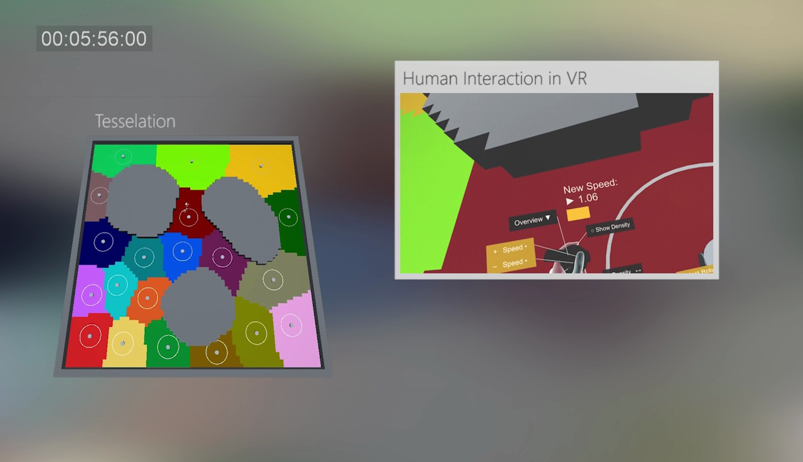
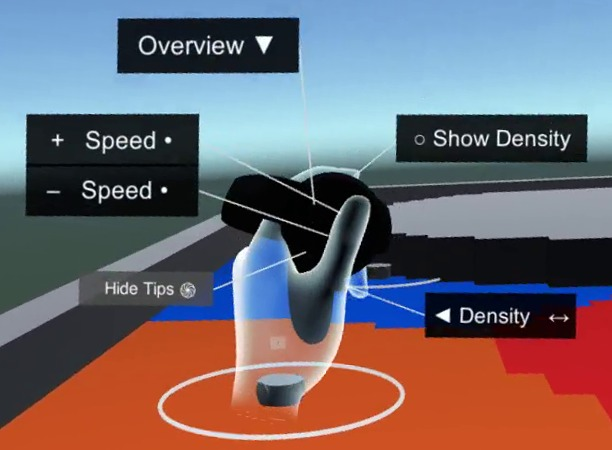
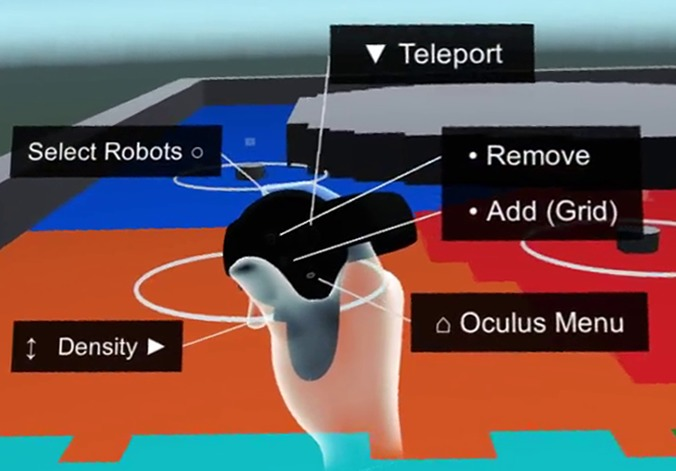

# Voronoi Unity Teleoperation

A Virtual Reality environment using **Unity3D** for **Human Swarm Interaction** with **ROS**.

This setup is ideal to teleoperate robots from distance or simulate reactive swarm algorithms. The user can interact with the robot swarm and shape the environment map.

**Watch** this video to see the project working: [Voronoi with Human Swarm Interaction using Virtual Reality](https://www.youtube.com/watch?v=tMZiT0ObciI)

## How It Works

This application creates a bridge between [**Unity3D**](https://unity3d.com/) and [**ROS**](http://www.ros.org/), making it possible to simulate a virtual environment with robots. For the communication between these two services is used the library [**ROS#**](https://github.com/siemens/ros-sharp).

The user can interact with the environment and the robots using a Virtual Reality Headset (**Oculus Rift** is supported at the time).

The library [**VRTK**](https://vrtoolkit.readme.io/) was used to aid on the development of VR scripts and serve as a driver for different headsets.

In this environment, users can freely walk around, change the density distribution function, create obstacles and increase the weight of selected robots. The coverage algorithm can react to any changes imposed by the human agent.

The environment on Unity was tested connecting to the [Voronoi Tesselation Algorithm](https://github.com/lucascoelhof/voronoi_hsi) on ROS.

---

These are the available user functions:

| Left Hand | Right Hand |
| -- | -- |
|  |  |

- **Overview:** show an upper vision of the map
- **Teleport:** teleport on the map using a raycast
- **Speed:** change the robot weight on the Voronoi Diagram
- **Density:** change position and height of the gaussian shaped density function
- **Grid:** add/remove obstacles on the map

## License

This project is distibuted under the [Apache License 2.0](LICENSE).

## References

* [Oculus SDK for Unity](https://developer.oculus.com/)
* [ROS-Sharp](https://github.com/siemens/ros-sharp)
* [VR Toolkit (VRTK)](https://vrtoolkit.readme.io/)
* [ROS Bridge](http://wiki.ros.org/rosbridge_suite)
